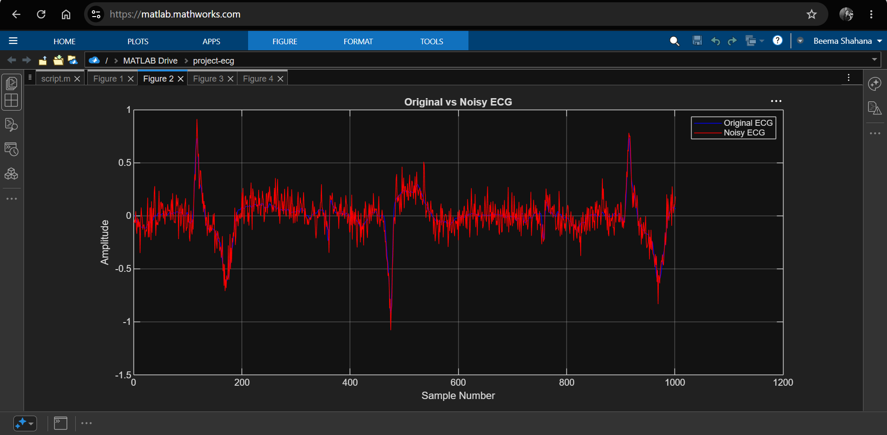
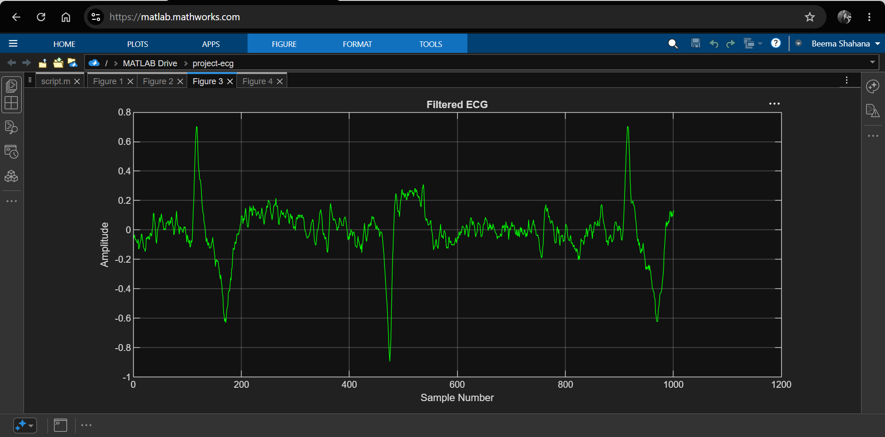
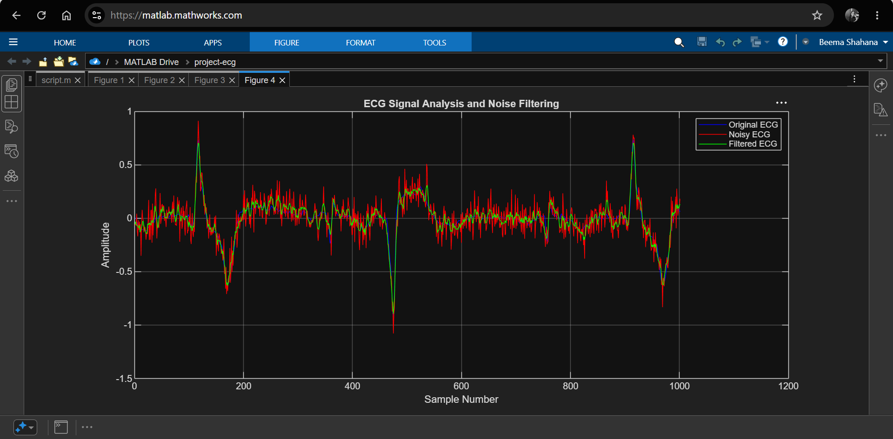
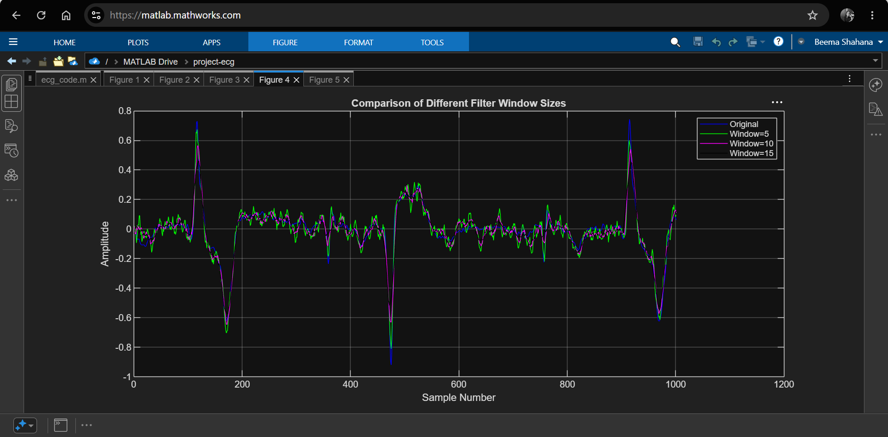

# ECG Signal Analysis and Noise Filtering

## Overview

This project demonstrates basic ECG signal processing using MATLAB. An ECG signal is loaded from a dataset, artificial noise is added to simulate real-world interference, and a moving average filter is applied to reduce the noise. The results are then compared using graphical analysis.

---

## Objectives

* Load and visualize an ECG signal
* Simulate noise in the ECG waveform
* Apply a moving average filter
* Compare original, noisy, and filtered signals
* Analyze the effect of different filter window sizes

---

## Tools Used

* MATLAB Online
* ECG Dataset (CSV format)

---

## Methodology

### 1. ECG Signal Acquisition

The ECG signal was imported from a CSV file and plotted for visualization.

### 2. Noise Addition

Gaussian noise was added to the ECG signal to simulate measurement noise and interference.

### 3. Signal Filtering

A moving average filter was applied to smooth the noisy ECG signal and reduce random fluctuations.

### 4. Performance Comparison

The original ECG, noisy ECG, and filtered ECG signals were plotted together for comparison.

### 5. Filter Window Analysis

Different moving average window sizes were tested to observe their effect on noise reduction and signal preservation.

---

## Results

The moving average filter successfully reduced noise while preserving the major ECG waveform characteristics.

Observations:

* The noisy signal contains random fluctuations and spikes.
* The filtered signal is smoother than the noisy signal.
* Larger filter window sizes provide greater smoothing but may slightly distort waveform details.
* Smaller window sizes preserve waveform features but remove less noise.

---
## Screenshots

### Original ECG Signal

### Noisy ECG Signal

### Filtered ECG Signal

### Original vs Noisy vs Filtered ECG

### Filter Window Size Comparison

---

## Future Improvements

* Implement Butterworth filtering
* Perform frequency-domain analysis using FFT
* Detect QRS complexes automatically
* Compare multiple filtering techniques
* Classify ECG abnormalities using machine learning

---

## Author

Beema Shahana Shiyad

B.Tech Electronics and Communication Engineering
