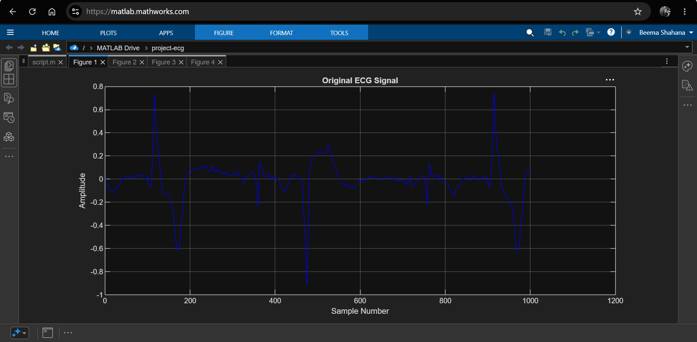
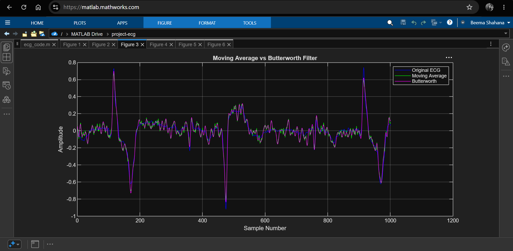
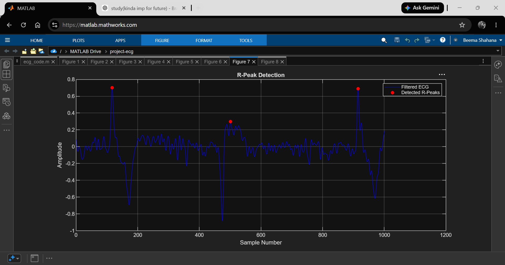
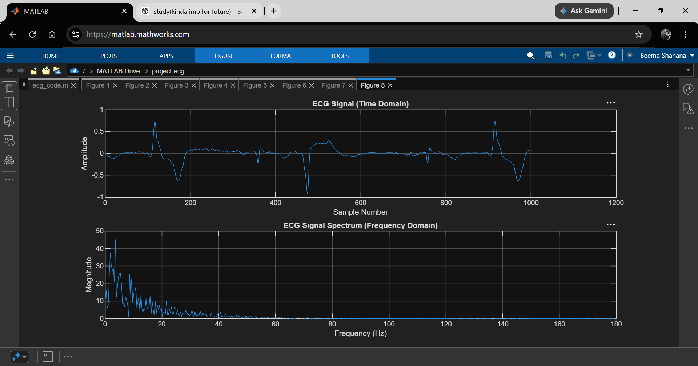
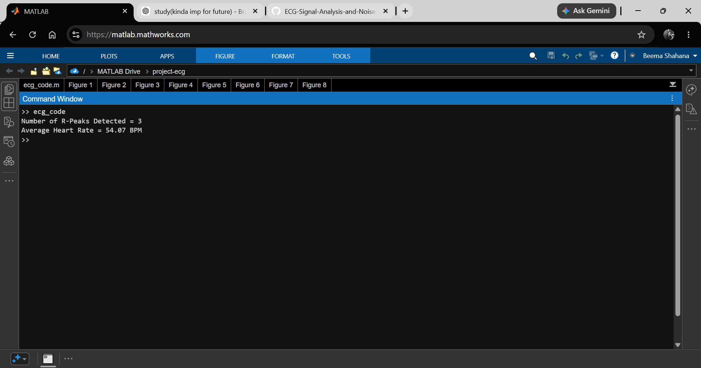

# ECG Signal Analysis and Noise Filtering

## Overview

This project demonstrates ECG signal processing and noise reduction using MATLAB. The ECG signal is loaded from a dataset, corrupted with artificial Gaussian noise, and filtered using both Moving Average and Butterworth filters. The filtered signal is analyzed in both time and frequency domains, R-peaks are detected automatically, and average heart rate is estimated from the detected peaks.

---

## Objectives

* Load and visualize ECG data
* Simulate noise in ECG signals
* Apply Moving Average filtering
* Apply Butterworth filtering
* Compare filtering techniques
* Perform frequency-domain analysis using FFT
* Detect R-peaks automatically
* Estimate average heart rate

---

## Features

* ECG signal visualization
* Gaussian noise simulation
* Moving Average filtering
* Butterworth filtering
* Filter comparison
* FFT spectrum analysis
* Automatic R-peak detection
* Heart rate estimation

---

## Technologies Used

* MATLAB
* Signal Processing Techniques
* FFT (Fast Fourier Transform)
* Butterworth Filtering
* Peak Detection Algorithms

---

## Project Workflow

ECG Data Acquisition

↓

Noise Addition

↓

Moving Average Filtering

↓

Butterworth Filtering

↓

Filter Comparison

↓

Frequency Domain Analysis (FFT)

↓

R-Peak Detection

↓

Heart Rate Estimation

---

## Results

### Original ECG Signal

### Moving Average vs Butterworth Comparison

### R-Peak Detection

### Frequency Domain Analysis

### Heart Rate Estimation

The project automatically detects R-peaks and estimates average heart rate from the ECG signal.

Average Heart Rate: **54.14 BPM**

Detected R-Peaks: **3**

---

## Folder Structure

ECG-Signal-Analysis-and-Noise-Filtering

├── ecg_code.m

├── ecg.csv

├── README.md

└── Screenshots

    ├── original_signal.png

    ├── noisy_signal.png

    ├── filtered_signal.png

    ├── filter_comparison.png

    ├── moving_average_vs_butterworth_comparison.png

    ├── frequency-domain_analysis.png

    ├── r-peak_detection.png

    ├── combined_ecg_analysis.png

    └── heart_rate_output.png

---

## Future Improvements

* Pan-Tompkins QRS Detection
* Real-Time ECG Monitoring
* GUI-Based ECG Analyzer
* Arrhythmia Detection
* Machine Learning-Based Classification

---

## Author

**Beema Shahana Shiyad**

B.Tech Electronics and Communication Engineering
